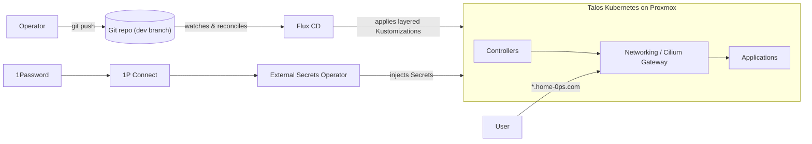

# home-0ps

A GitOps-managed Kubernetes home lab — Talos Linux on Proxmox, reconciled by
Flux CD from this repo's `dev` branch, with secrets sourced from 1Password via
the External Secrets Operator. This site is the **architecture & network
reference** for the running lab: how the layers fit together, how traffic flows,
and where each component lives. For the rolling open-items list, see the newest
[review](reviews/home-0ps-review-2026-05-25.md).

## System context

## Reference map

-   :material-lan:{ .lg .middle } **Network**

    ---

    Cilium CNI & Gateway, DNS split-horizon, ingress and external exposure.

    [:octicons-arrow-right-24: Networking](infra/networking.md) ·
    [DNS](infra/dns.md)

-   :material-server-network:{ .lg .middle } **Infrastructure**

    ---

    Storage, observability, secrets & PKI — the platform layers.

    [:octicons-arrow-right-24: Storage](infra/storage.md) ·
    [Observability](infra/observability.md) ·
    [Secrets & PKI](infra/secrets-pki.md)

-   :material-apps:{ .lg .middle } **Applications**

    ---

    The live workloads, how each is deployed, exposed, and recovered.

    [:octicons-arrow-right-24: Authentik](apps/authentik.md) ·
    [FreshRSS](apps/freshrss.md) ·
    [Homer](apps/homer.md)

-   :material-file-document-outline:{ .lg .middle } **Decisions & Operations**

    ---

    Architecture decision records, best practices, status, and reviews.

    [:octicons-arrow-right-24: Decisions](decisions/0001-sso-authentik.md) ·
    [Best Practices](guides/best-practices.md) ·
    [Status](status.md)

## Conventions

- **Current open items** live in the newest `reviews/home-0ps-review-<date>.md`
  (regenerated by `/lab-review`); older reviews are kept as the record.
- **ADR statuses:** Draft → Proposed → Accepted → Superseded. Superseded ADRs
  stay, with a pointer to what replaced them.
- **Archive is read-only history** — retired-app manifests and the original
  narrative ([journey](archive/journey.md)) live under `archive/`.
