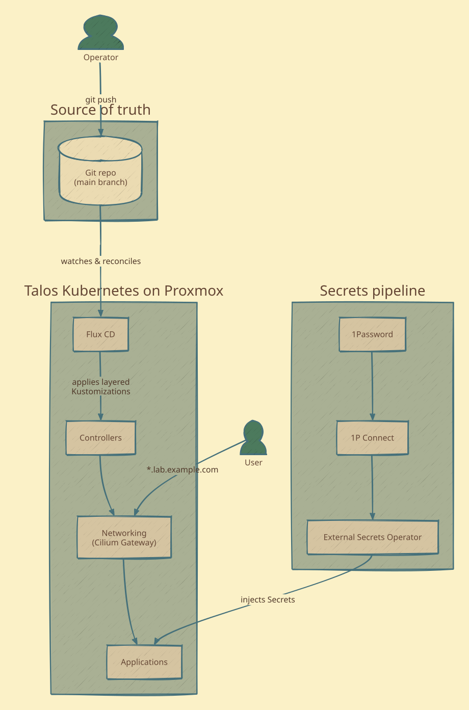

# Diagrams

Architecture and flow diagrams for the docs site, authored as code with
[D2](https://d2lang.com) in **sketch mode** and themed to match the
gruvbox-material site palette.

## Why D2 (and not Mermaid)

Mermaid's rigid orthogonal layout reads as machine-generated. D2's layout
engine plus sketch mode gives an organic, hand-drawn look while staying
text-based and reproducible in CI. [mingrammer/diagrams](https://diagrams.mingrammer.com)
was also evaluated for its vendor logos, but its fixed icon set (baked-in
labels, no 1Password/ESO marks) fought the content; D2 won on flexibility
and theme control.

## Layout

```
diagrams/
  src/*.d2          # diagram sources (edit these)
  *.svg             # rendered output (committed; embedded by docs pages)
  render.sh         # render src/*.d2 -> *.svg
```

## Rendering

```bash
brew install d2
./render.sh                 # all sources
./render.sh system-context.d2   # one source
```

Each source embeds both palettes via `vars.d2-config`:
`theme-overrides` (gruvbox light) and `dark-theme-overrides` (gruvbox dark).
The emitted SVG switches with `prefers-color-scheme`, so a single file serves
both the light and dark site themes.

## Embedding in docs

```markdown

```
